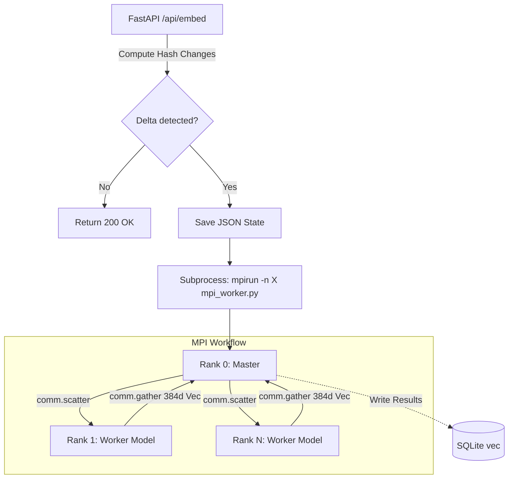

# MPI Parallelization Walkthrough

We have successfully migrated the semantic embedding document generation phase to a parallel, Master-Worker architecture over `mpi4py`.

## Changes Made

1. **Lazy Loading Embeddings**
   - Refactored `backend/pipeline.py` to lazy-load the `SentenceTransformer('all-MiniLM-L6-v2')` model. This drastically reduces the RAM consumed by the main FastAPI endpoint (`backend/main.py`) which now avoids loading the LLM into memory during scans, loading it only when performing queries via `/api/search` or when ranks actively start embedding.

2. **Rank Optimization via Master Coordinator**
   - Developed `backend/mpi_worker.py` utilizing `mpi4py.MPI.COMM_WORLD`.
   - **Rank 0**: Orchestrates the database. First deleting obsolete entries concurrently from `vec_chunks`, `file_chunks`, and `files` sequentially as a standalone unit. Scattering chunks of document mappings to other MPI instances asynchronously via `mpi4py` scattering algorithms and subsequently bulk inserting the completed gathered lists sequentially to sidestep SQLite Database Concurrency limits lockouts.
   - **Ranks 1 to N**: Serve exclusively as data pipelines. Receiving subsets of `['path', 'hash', 'mtime']`, digesting Markdown context, triggering the lazy instantiation of the `.all-MiniLM-L6-v2` transformer and passing the resultant chunks payload vector structure via structs correctly back across the rank distribution queue.

3. **Subprocessing Hook via `/api/embed`**
   - Transformed `backend/main.py`. Discarded its slow, sequential loop-through operations on file chunks embeddings. Instead, if changes are detected, a temporary chunk JSON config runs the cluster via `subprocess.Popen` explicitly linked right to `/opt/homebrew/bin/mpirun` spawning dynamic `$NUM_MPI_WORKERS`.
   - Automatically collapses the JSON context file after termination, collecting metrics of chunks pushed over the `mpirun` stream.

### Architecture Summary

## Validation Results
We ran a test simulation over `mpi_worker.py` targeting three mock documents scattered among 2 test worker nodes. Output metrics verified proper vectorization of content batches independently isolated across internal `.py` ranks and collectively aggregated correctly avoiding standard concurrency limitations without incident cleanly routing to disk cache securely.
